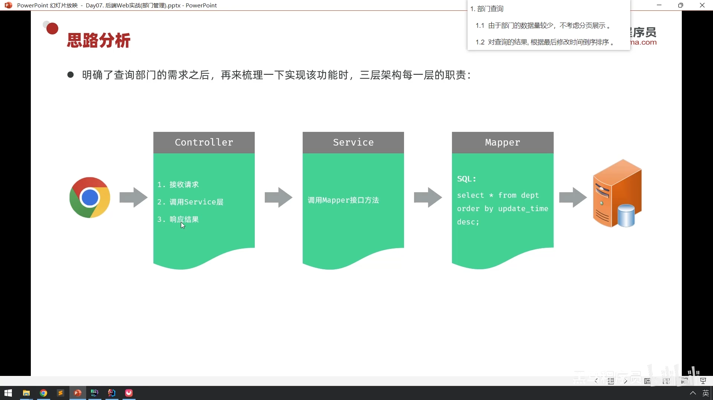
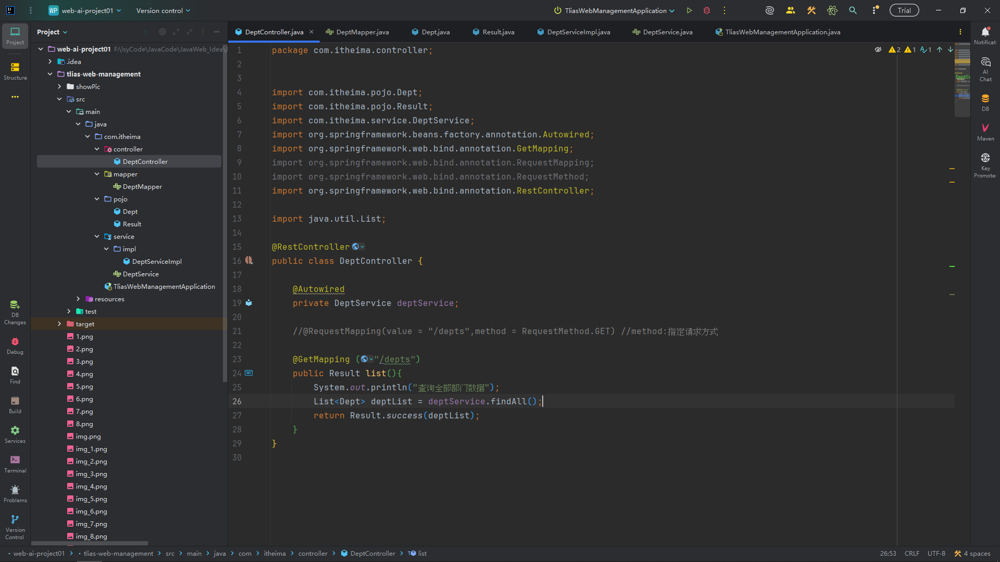
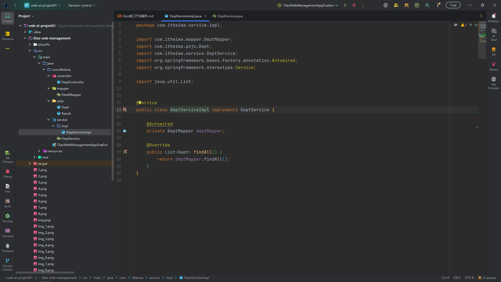
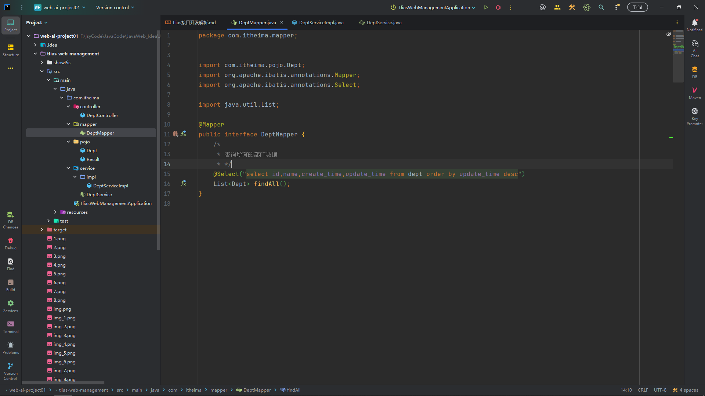
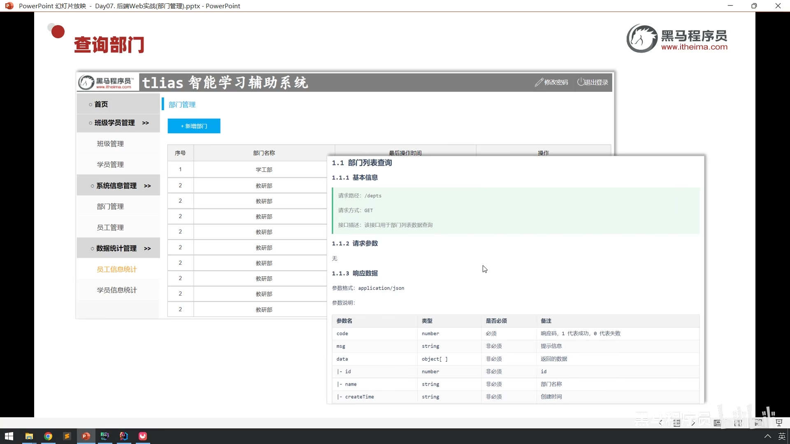
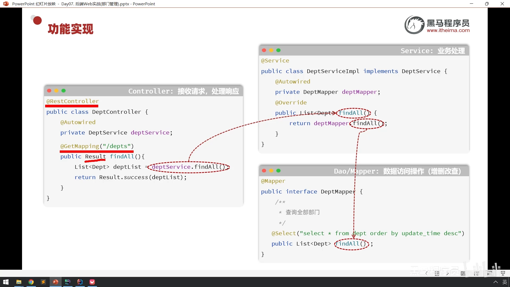

## 01. 列表查询-接口开发

_整个流程的执行顺序是：从左到右（发起请求），再从右到左（返回数据）_
### 第一阶段：请求进入 (Controller 层)
   

1. 接收请求 (图片左侧 Controller 第1点)
   * 动作：浏览器（Chrome）发起请求，Controller 监听到这个请求。
   * 对应代码 (DeptController.java)：

         // 对应图片的 "1. 接收请求"
         @GetMapping("/depts")
         public Result list() { ... }

* 解释：@GetMapping("/depts") 就像一个门牌号，它告诉程序：凡是往 /depts 发的 GET 请求，都由这个 list() 方法来接待。

2. 调用 Service 层 (图片左侧 Controller 第2点)
   * 动作：Controller 不亲自查数据，而是指挥 Service 去做。
   * 对应代码 (DeptController.java)：

         // 对应图片的 "2. 调用Service层"
         List<Dept> deptList = deptService.findAll();
   
* 解释：这里调用了 deptService 对象的 findAll() 方法，程序的控制权从 Controller 转交给了 Service。

### 第二阶段：业务处理 (Service 层)

3. 调用 Mapper 接口方法 (图片中间 Service 模块)
   * 动作：Service 接到任务， Service 实现类去调用持久层（Mapper）。
   * 对应代码 (DeptServiceImpl.java)：

         // 对应图片的 "调用Mapper接口方法"
         @Override
         public List<Dept> findAll() {
              return deptMapper.findAll(); // 这一行代码
         }

* 解释：Service 层在这个简单的例子里只是做了一个中转，它调用了 deptMapper.findAll()。

### 第三阶段：数据查询 (Mapper 层 & 数据库)

4. 执行 SQL (图片右侧 Mapper 模块)
   * 动作：Mapper 接口告诉数据库要执行什么 SQL 语句。
   * 对应代码 (DeptMapper.java)：

         // 对应图片的 "SQL: select * from dept..."
         @Select("select id, name, create_time, update_time from dept order by update_time desc")
         List<Dept> findAll();

* 解释：MyBatis 框架会把这就话翻译成数据库能听懂的指令，去数据库里把数据捞出来，并封装成 List<Dept> 列表。

### 第四阶段：数据回传与响应 (返回流程)

注意：虽然图片箭头是向右的，但数据拿到后是向左回传的。
5. 数据回传 (Mapper -> Service -> Controller)
    * 动作：
   * Mapper 拿到数据，return 给 Service。
   * Service 拿到数据，return 给 Controller。
   * 对应代码：
   * DeptServiceImpl.java: return deptMapper.findAll();
   * DeptController.java: List<Dept> deptList = ... (此时变量里已经有数据了)

---

return deptMapper.findAll(); 
* 这行代码写得太简练了，它把“拿数据”和“交数据”两个动作合并写在了一行里。
* 为了让你看清这个过程，我们把这一行代码拆解开来，还原成它原本的样子，你就瞬间明白了。
* 把一行代码拆成两行看 ,在 DeptServiceImpl.java 中，现在的写法是：

      @Override
      public List<Dept> findAll() {
           // 简写版：直接拿、直接给
           return deptMapper.findAll();
           }
   如果我们把它展开，写成两行，逻辑是这样的：
   
      @Override
      public List<Dept> findAll() {
          // 动作 A：Service 伸手向 Mapper 要数据
          // deptMapper.findAll() 执行完后，会变出一个 list 结果
          List<Dept> tempResult = deptMapper.findAll();
      
          // 此时，数据已经从 Mapper 流动到了 Service 手里 (存在 tempResult 变量里)
      
          // 动作 B：Service 转手把这个数据交回给上一级 (Controller)
          return tempResult;
      }

---

6. 响应结果 (图片左侧 Controller 第3点)
    * 动作：Controller 把拿到的数据包装好，发回给浏览器。
   * 对应代码 (DeptController.java)：

         // 对应图片的 "3. 响应结果"
         return Result.success(deptList);
* 解释：Result.success 把 deptList 装进 code:1, msg:success, data:... 的格式里，最终转换成 JSON 发送给浏览器展示。

**_总结执行顺序_**
1. 浏览器 发起请求。
2. Controller (@GetMapping) 接收请求。
3. Controller (deptService.findAll()) 呼叫 Service。
4. Service (deptMapper.findAll()) 呼叫 Mapper。
5. Mapper (@Select) 执行 SQL，从数据库取回数据。
6. 数据层层 return 回到 Controller。
7. Controller (return Result.success) 将最终结果响应给浏览器。

